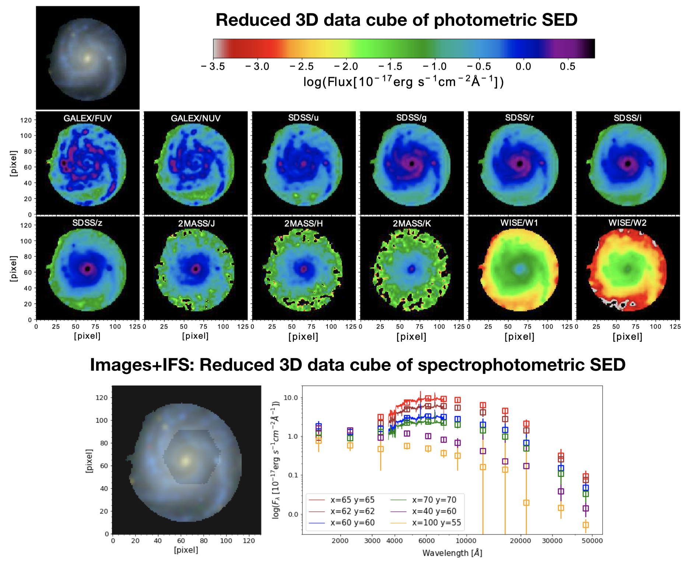
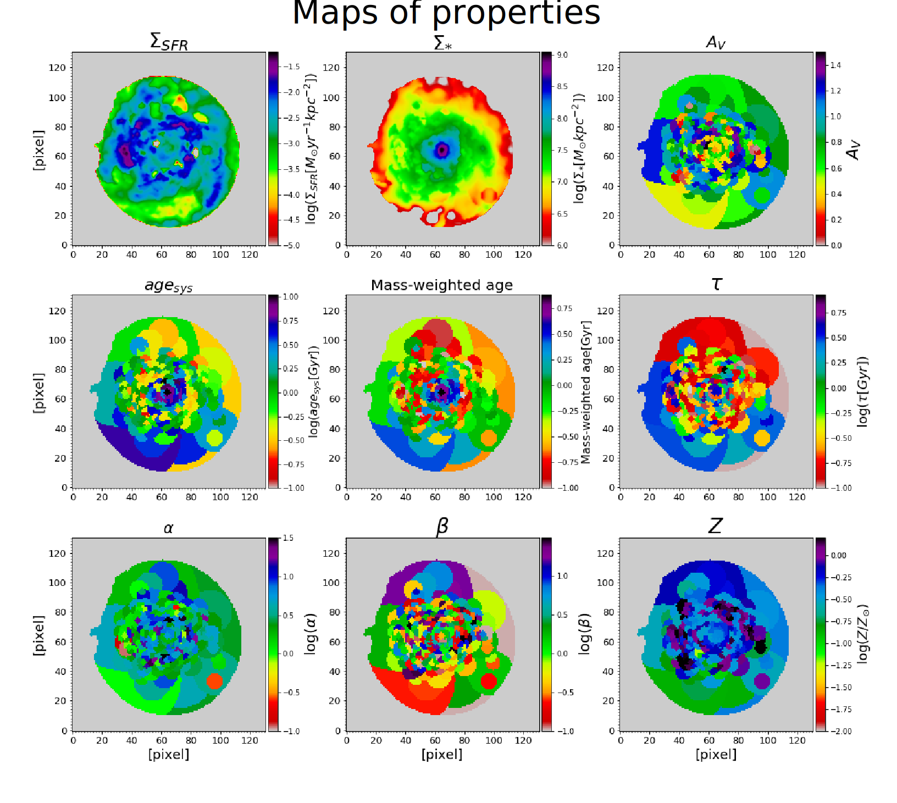

# piXedfit

**piXefit** is a Python package that provides a self-contained set of tools for analyzing spatially resolved properties of galaxies using 
imaging data or a combination of imaging data and the integral field spectroscopy (IFS) data. **piXedfit** has six modules that can 
handle all tasks in the analysis of the spatially resolved SEDs of galaxies, including images processing, a spatial-matching between reduced 
broad-band images with an IFS data cube, pixel binning, performing SED fitting, and making visualization plots for the SED fitting results. 
**piXedfit** is a versatile tool that has been equipped with the multiprocessing module, namely message passing interface or MPI, for 
efficient analysis of the datasets of a large number of galaxies. Detailed description on **piXedfit** and demonstration of its performances 
are presented in [Abdurro'uf et al. (2021)](https://ui.adsabs.harvard.edu/abs/2021ApJS..254...15A/abstract). 

Detailed documentation of **piXedfit** is given at this [website](https://pixedfit.readthedocs.io/en/latest/index.html). 
To get the first glance of how **piXedfit** works, the folder `examples` contains demonstrations on how to use this tool for measuring spatially resolved stellar population properties of a galaxy using a combination of 12-band imaging data (from GALEX, SDSS, 2MASS, and WISE) and IFS data from CALIFA.

Some **animations** can be seen from: [images processing](https://github.com/aabdurrouf/piXedfit/blob/main/docs/source/demos_img_pros.rst), [pixel binning](https://github.com/aabdurrouf/piXedfit/blob/main/docs/source/demos_pixel_binning.rst), and [SED fitting](https://github.com/aabdurrouf/piXedfit/blob/main/docs/source/demos_sed_fitting.rst).





## Features
**piXedfit** has 6 modules that can work independent with each other such that a user interested of using a particular module in **piXedfit** 
doesn't need to use the other modules. For instance, it is possible to use the SED fitting module for fitting any observed SED, either integrated 
of spaially resolved SED, without the need of using the image processing and pixel binning modules. The 6 modules and their usabilities are the following:

*  `piXedfit_images`: **image processing**
   
   This module is capable of doing spatial-matching (in spatial resolution and spatial sampling) of multiband imaging data ranging from FUV to FIR 
   (from ground-based and spaced-based telescopes) and extract pixel-wise photometric SEDs within the galaxy's region of interest. 

*  `piXedfit_spectrophotometric`: **spatial-matching of imaging data and the IFS data**
   
   This module is capable of doing spatial-matching (in spatial resolution and sampling) of a multiband imaging data 
   (that have been processed by the `piXedfit_images`) with an IFS data cube (containing the same galaxy) and extract pixel-wise 
   spectrophotometric SEDs within the galaxy's region of interest. For the current version of **piXedfit**, only the IFS data from 
   the [CALIFA](https://califa.caha.es/) and [MaNGA](https://www.sdss.org/surveys/manga/) surveys can can be analyzed with 
   the `piXedfit_spectrophotometric` module.   

*  `piXedfit_bin`: **pixel binning**
   
   This module is capable of performing pixel binning, which is a process of combining neighboring pixels to achieve certain S/N thresholds.
   The pixel binning scheme takes into account the similarity of SED shape among the pixels that are going to be binned together. This way 
   important spatial information from the pixel scale can be expected to be preserved. The S/N threshold can be set to all bands, not limited to a particular band.   

*  `piXedfit_model`: **generating model SEDs**
   
   This module can generate model SEDs of galaxies given some parameters. The SED modeling uses the [FSPS](https://github.com/cconroy20/fsps) SPS model 
   with the [Python-FSPS](http://dfm.io/python-fsps/current/) as the interface to the Python environment. The SED modeling incorporates the modeling 
   of light coming from stellar emission, nebular emission, dust emission, and the AGN dusty torus emission.      

*  `piXedfit_fitting`: **performing SED fitting**
   
   This module is capable of performing SED fitting to input SEDs of either spatially resolved (i.e., kpc-scale) or integrated (galaxy's global scale) SEDs.
   This SED fitting module can perform a simultaneous fitting of photometric and spectroscopic SEDs (i.e., spectrophotometric SED).

*  `piXedfit_analysis`: **making visualization plots for the SED fiting results**
   
   This module can make three plots for visualizing the fitting results: corner plot (i.e., a plot showing 1D and joint 2D posteriors of the parameters), 
   SED plot (i.e., a plot showing recovery of the input SED by the best-fit model SED), and SFH plot (i.e., a plot showing inferred SFH from the fitting).
   
## Kernels
Because of the large sizes of the kernel files, we do not upload them to this GitHub repository. We put the kernel files on this [link](https://drive.google.com/drive/folders/1pTRASNKLuckkY8_sl8WYeZ62COvcBtGn?usp=sharing). To be able to use image processing feature (`piXedfit_images`), you need to download the necessary kernel files and copy them to `/data/kernels`. List of the kernel files needed for image processing would depend on the imaging data that will be analyzed.  
   
## How to get the code
Currently, we are working on documentation of **piXedfit** and we plan to publicly release the codes in next few month (before summer 2022). In the meantime, if you are interested in using **piXedfit**, please contact Abdurro'uf (abdurrouf@asiaa.sinica.edu.tw). We are very welcome to any ideas of researches employing **piXedfit**.  

## Citation
If you use this code for your research, please reference [Abdurro'uf et al. (2021)](https://ui.adsabs.harvard.edu/abs/2021ApJS..254...15A/abstract):

```
@ARTICLE{2021ApJS..254...15A,
       author = {{Abdurro'uf} and {Lin}, Yen-Ting and {Wu}, Po-Feng and {Akiyama}, Masayuki},
        title = "{Introducing piXedfit: A Spectral Energy Distribution Fitting Code Designed for Resolved Sources}",
      journal = {\apjs},
     keywords = {Astronomical methods, Bayesian statistics, Galaxy evolution, Posterior distribution, 1043, 1900, 594, 1926, Astrophysics - Astrophysics of Galaxies},
         year = 2021,
        month = may,
       volume = {254},
       number = {1},
          eid = {15},
        pages = {15},
          doi = {10.3847/1538-4365/abebe2},
archivePrefix = {arXiv},
       eprint = {2101.09717},
 primaryClass = {astro-ph.GA},
       adsurl = {https://ui.adsabs.harvard.edu/abs/2021ApJS..254...15A},
      adsnote = {Provided by the SAO/NASA Astrophysics Data System}
}
```

   
## Reference
A list of some projects **piXedfit** is benefitted from:
*  [Astropy](https://www.astropy.org/)
*  [Photutils](https://photutils.readthedocs.io/en/stable/)
*  [Aniano et al. (2011)](https://ui.adsabs.harvard.edu/abs/2011PASP..123.1218A/abstract) who provides convolution [kernels](https://www.astro.princeton.edu/~ganiano/Kernels.html)
*  [FSPS](https://github.com/cconroy20/fsps) and [Python-FSPS](http://dfm.io/python-fsps/current/) stellar population synthesis model
*  [emcee](https://emcee.readthedocs.io/en/stable/) package for the Affine Invariant Markov Chain Monte Carlo (MCMC) Ensemble sampler
*  [SExtractor](https://www.astromatic.net/software/sextractor) ([Bertin & Arnouts 1996](https://ui.adsabs.harvard.edu/abs/1996A%26AS..117..393B/abstract))


